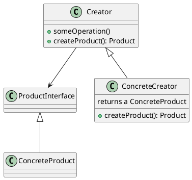

import Image from "@components/Image/Image";

# Factory

Factory patterns are so called creational patterns meaning their intent is to abstract/hide how objects are created. Which in return allows the client to be in independent of how its objects are created.

## Factory method

The factory method pattern delegates the instantiation of objects to a method in either subclasses or a static method. The disadvantage of having the factory method as a static method is it can not be subclassed to change the behavior however you don't need to create an object to make use of the method.

### Structure



### Example

<Image 
    src="/cs/patternsFactoryMethod.png"
    caption="An example of the factory method pattern for a pizza store."
    width={800}
/>

## Abstract factory

The factory method pattern delegates the instantiation of object familys to a another object.

### Structure

<Image 
    src="/cs/patternsAbstractFactoryStructure.png"
    caption="Structure of the abstract factory pattern."
    width={800}
/>

A big question here is where is the concrete Factory so they can all have acces to it. Often this is done in it's own class

```java
public class CurrentFactory {
 private CurrentFactory() { }; // prevents instantiation
 private static Factory fac = null;
 public static Factory getFactory() { return fac; }
 public static void setFactory(Factory f) {
  if (f == null) throw new NullPointerException();
  fac = f;
 }
}
```

### Example

<Image 
    src="/cs/patternsAbstractFactory.png"
    caption="An example of the abstract factory pattern for a pizza store."
    width={800}
/>
