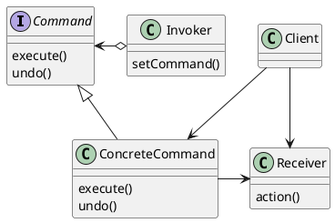

import Callout from "@components/Callout/Callout";

# My Digital Garden

Welcome to my digital garden. This is a place where I can share my thoughts and notes on various topics. 
The notes are continuously updated and refined. Feel free to explore and learn something new.

## What is a Digital Garden?

A digital garden is a mix between a notebook and a blog, it is a place to share thoughts and cultivate them into a garden.
It also allows me to have a place where I can store my notes/summaries/tutorials for my studies.

The main difference to a blog is that a blog has articles and publication dates and never changes after it has been
published, whereas a digital garden is a place where the written content can be continuously edited and refined. The
notes are also very free flowing they can span from just a short cheat sheet to a full set of notes on an entire subject
where you go into every nitty-gritty detail.

Another key difference is the navigation. A blog is usually read in chronological order but a digital garden can be read
in any order you want and uses lots of internal links to connect all the notes into a Network (although this can be
quite hard to diligently do).

If you are interested in learning more about digital gardens I can recommend the following
[article by Maggie Appleton](https://maggieappleton.com/garden-history).

## How is my Garden Built?

The current iteration of my digital garden is built using [Nextra](https://nextra.site/). Nextra is a static site 
generator that is built on top of Next.js and MDX. This allows me to write my notes in markdown and also use the MDX 
format to write JSX in my markdown files. These markdown files are then converted into static HTML files using Next.js 
and can be hosted on any static site hosting service such as [Vercel](https://vercel.com/).

## Features

In this section I briefly go over some of the features that are supported by my digital garden and how to use them.

### Markdown

Markdown is supported out of the box. Anything that is supported by markdown can be used in the notes. This includes but
is not limited to:

- Headers
- Lists
- Links
- Images
- Code Blocks
- Tables
- Blockquotes

For a full list of markdown features check out the [Markdown Guide](https://www.markdownguide.org/).

### MDX

In addition to the normal markdown format, Nextra also supports the MDX format which allows you to write JSX, i.e. react code in a
markdown file. To find out more about MDX check out the [official MDX documentation](https://mdxjs.com/).

#### Admonitions / Callouts

Admonitions aren't included in standard markdown but have become very popular. Recently GitHub has also added support for 
admonitions in markdown FileSystem, however they call them alerts. 

Admonitions are very useful to highlight certain text and add a category to the text. I have added a custom component that 
builds on nextra's callouts to be able to add custom callout types. To use callouts in a MDX file you can use the following syntax:

```mdx
<Callout type="warning">
This Is a big scary warning.
</Callout>
```

Renders to:

<Callout type="warning">
This Is a big scary warning.
</Callout>

You can also change the title of the banner:

```mdx
<Callout type="info" title="The following types are supported">
info, warning, error, example, todo
</Callout>
```

<Callout type="info" title="The following types are supported">
info, warning, error, example, todo
</Callout>

The default callout type uses the websites primary color, a rocket icon and has no title:

<Callout>
This is a default callout.
</Callout>

### Jupyter Notebooks

<Callout type="todo">
TODO add how the hound works and how to use it. But in short I can use the hound to convert Jupyter Notebooks to markdown files. It is called the hound because it watches over my notes and when they change it will bark after converting the changed notebooks to markdown files.
</Callout>

### LaTeX

It has recently become very popular to write LaTeX equations in markdown. Nextra supports this by using [MathJax](https://www.mathjax.org/).
You can render LaTeX content either inline between `$\LaTeX$` which renders as $\LaTeX$ or as a block using the same syntax 
as a code block with the three backticks and the `math` language identifier.

```math
I = \int_0^{2\pi} \sin(x)\,dx
```

Luckily Jupyter Notebooks also use MathJax to render LaTeX content in the same way. This means that nextra 
supports everything. This leads to [my LaTeX Notation Guideline](/garden/maths/latexGuidelines) to have 
a consistent notation across all notes.

You can see what is supported by MathJax [here](https://docs.mathjax.org/en/latest/input/tex/macros/index.html).

<Callout type="info">
I used to use KaTeX to render LaTeX content but switched to MathJax as it matches the features and rendering of Jupyter Notebooks. However, it seems that MathJax is not as fast as KaTeX, so if you notice a performance issue with the rendering of LaTeX content, so I might switch back to KaTeX in the future.
</Callout>

### PlantUML

If you ever need to create diagrams and especially UML diagrams, PlantUML is the way to go. I started with Mermaid
to create UML diagrams but swapped to PlantUML for the additional features and the ability to create custom themes
(so everything can be minimalist and purple :D).

To render PlantUML diagrams the [Remark plugin Simple PlantUML](https://github.com/akebifiky/remark-simple-plantuml) is
used which uses the official PlantUML server to generate an image and then adds it.

An Example can be seen below, on the [official website](https://plantuml.com/) and also on [REAL WORLD PlantUML](https://real-world-plantuml.com/?type=class).



To use my custom theme you can use the following line at the beginning of the PlantUML file:

```
@startuml
!theme purplerain from https://raw.githubusercontent.com/LuciferUchiha/georgerowlands.ch/refs/heads/main/

...

@enduml
```

My custom theme also has some processes built in for simple text coloring for example in cases of success, failure etc.

```plantuml
@startuml
!theme purplerain from https://raw.githubusercontent.com/LuciferUchiha/georgerowlands.ch/refs/heads/main/

Bob -> Alice :  normal
Bob <- Alice :  $success("success: Hi Bob")
Bob -x Alice :  $failure("failure")
Bob ->> Alice : $warning("warning")
Bob ->> Alice : $info("finished")

@enduml
```

## How can I Contribute?

Do you enjoy the content and want to contribute to the garden by adding some new plants or watering the existing ones?
Then feel free to make a pull request. There are however some rules to keep in mind before adding or changing content.

- Markdown filenames and folders are written in camelCase.
- Titles should follow the
[IEEE Editorial Style Manual](https://www.ieee.org/content/dam/ieee-org/ieee/web/org/conferences/style_references_manual.pdf). The titles are at the top of the mdx file. For the page to work and correctly render the file should also be added to the `_meta.json` file in the same folder as the mdx file. This file is responsbile for the navigation and the metadata of the page such as ordering.
- LaTeX should conform with my [notation and guideline](/garden/maths/latexGuidelines), if something is not defined there you can of course add it.