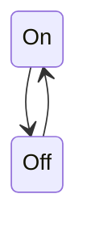

# Actor Model

The actor model is a mechanism to deal with concurrent computation. An actor (autonomous concurrent object) is the primitive unit of computation. Actors are executed asynchronously of each other and have the following:

- Private state, as actors there should be no shared mutable state between actors!
- An Inbox that stores the received messages in FIFO order.
- Behavior that is executed asynchronously when it receives a message from other actors.

The key concept is that actors are completely isolated from each other and they will never share memory. The only way they can share states is by exchanging messages with each other.


## Scala Akka

Actors in Scala are implemented with the akka library. Akka is very popular because it is very simple and self-explanatory but also because it has very high performance. It can send up to 50 million messages per second and 2.5 million actors take up 1 GB on the heap.

### Creating an Actor

To work with akka you need to create an actor system. This is the network/container for all the actors. To then create an Actor you need to extend the Actor class and implement the receive method, this is the method that will be called when a message is received. To then create a reference to the actor you need to instantiate it as part of the actor system with the `actorOf` method. The returned reference is immutable. You can only create actors this way if you try to instantiate an actor with new you will get an `akka.actor.ActorInitializationException`. Finally, you can send messages to the actor by using the `!` operator.

```scala
import scala.language.postfixOps // required for `a ! msg` p
import akka.actor.{ActorSystem, Actor, ActorRef, Props}

val as = ActorSystem("as") // Actor infrastructure
class PrintActor extends Actor { // Actor definition
    var nthRequest = 0 // Mutable state
    def receive = { case msg => // Behavior
        nthRequest += 1
        println(s"$nthRequest:$msg")
    }
}
val printActor: ActorRef = as.actorOf(Props[PrintActor]) // Creates and starts actor

printActor ! "Hello"
printActor ! "Bye"
```

In most cases the actor is created with the default constructor then you can use `as.actorOf(Props[PrintActor])`. However, if you want to pass arguments to the constructor then you can do something like this:

```scala
class HelloActor(myName: String) extends Actor {
    def receive = {
        case "hello" => println(s"hello from $myName")
        case _       => println(s"'huh?', said $myName")
    }
}

object Main extends App {
    val as = ActorSystem("HelloSystem")
    val helloActor = as.actorOf(Props(new HelloActor("Fred")), name = "helloActor")
}
```

You can also create an actor as an anonymous subclass:

```scala
val print: ActorRef = as.actorOf(Props(
    new Actor {
        def receive = { case msg => println(msg) }
    }
))
```

Akka also supports hierarchies between actors for example you can have child actors for specific functionality:

```scala
val as = ActorSystem("as")

class ChildActor() extends Actor {
    def receive = {
        case msg => println("I'm " + self + " : " + msg) // self is like this in actor
    }
}

class ParentActor extends Actor {
    val child = context.actorOf(Props[ChildActor], "child")
    def receive = {
        case msg: String =>
        child ! "Greets from dad"
        println(msg)
    }
}

val p = as.actorOf(Props[ParentActor], "parent")
p ! "Hi Kid"
p ! "Bye Kid"
```

### Sending Messages

Messages are sent asynchronously with the tell `!` operator. Messages are stored in the mailbox of the receiver and can be anything (type Any). Messages are sent with the guarantee of at-most-once delivery / no guaranteed delivery (send-and-pray) however if the actor system is local then it is as guaranteed as to when calling a method.

### Receiving Messages

The `receive` method specifies the initial behavior of an actor when it receives a message. The function uses pattern matching and is defined as `def receive: PartialFunction[Any,Unit]` meaning it is only defined for certain arguments. You can check if a function is defined for a given argument using the `isDefinedAt` method.

```scala
val pf: PartialFunction[Any,Unit] = {
    case i: Int if i > 42 => println("huge")
    case s: String => println(s.reverse)
}
pf.isDefinedAt(42) // false
pf.isDefinedAt(43) // true
```

If there is no match then there is `MatchError` and the message is published to the actor system's EventStream, which you can imagine as a dead letterbox. You can however add listeners to this letterbox and react to messages that end up there.

Typically case classes (similar to Java records) are used as messages because they describe the vocabulary an actor understands (its API) and they are convenient for match expressions. You can also refine cases with so-called Guards as seen below.

```scala
case class PrintMsg(msg: String)
case class ShoutMsg(msg: String)
class PrintActor extends Actor {
    def receive = {
        case PrintMsg(m) if m.contains("@") => println("mail: " + m)
        case PrintMsg(m) => println("text: " + m)
        case ShoutMsg(m) => println("RECEIVED: " + m.toUpperCase)
    }
}
```

Message processing is scheduled on a thread pool this means that not every message of an actor is necessarily processed by the same thread. This also means we need some new guarantees:

- The send of a message happens-before the receive of that message
- Processing of one message happens-before processing the next message by the same actor

### Advanced Messaging

You should use `self` (of type ActorRef) to refer to the current actor to safely pass it around. You can also use `sender` to refer to the actor that sent a message.

```scala
val as = ActorSystem("as")

case class Msg(msg: String, sender: ActorRef)

class EchoActor extends Actor {
    def receive = { case Msg(msg,client) => client ! msg}
}
val echoActor = as.actorOf(Props[EchoActor])

class Sender extends Actor {
    echoActor ! Msg("Hello", self)
    def receive = { case t => println(t) }
}
```

The above example could be simplified to:

```scala
val as = ActorSystem("as")

class EchoActor extends Actor {
    def receive = { case msg => sender ! msg }
}
val echoActor = as.actorOf(Props[EchoActor])

class Sender extends Actor {
    echoActor ! "Hello"
    def receive = { case t => println(t) }
}
```

Using `context.setReceiveTimeout` you can set a timeout for inactivity (when no messages are sent). When the timeout is excited a ReceiveTimeout message is triggered.

```scala
class TimeOutActor extends Actor {
    context.setReceiveTimeout(3.second)
    def receive = {
        case "Tick" => println("Tick")
        case ReceiveTimeout => println("TIMEOUT")
    }
}
```

#### Ask Pattern

Akka also supports Futures. So you can send a message and receive a future containing the answer of the actor. This is done using the ask `?` operator.

```scala
class EchoActor extends Actor {
    def receive = { case msg => sender ! msg }
}
val as = ActorSystem("as")
val echoActor = as.actorOf(Props[EchoActor])
implicit val timeout = Timeout(3.seconds) // consumed by '?'
val futResult: Future[Any] = (echoActor ? "Hello") // completed with AskTimeoutException in case of timeout
// OR
val timeout = Timeout(3 seconds)
val futResultString: Future[String] = (echoActor ? ("Hello")(timeout)).mapTo[String] // cast to specific type

import as.dispatcher // ExecutionContext required by Future#map, Future#onComplete etc.
futResultString.map(s => s.toUpperCase)
```

## Finite State Machines

The actor model is ideal for representing finite state machines, as the states are the actors and the events can be represented with messages. For example, we can model a simple light switch:



```scala
case object On
case object Off
class Switch extends Actor {
    var on = false
    def receive = {
        case On if !on => println("turned on"); on = true
        case Off if on => println("turned off"); on = false
        case _ => println("ignore")
    }
}
```

Akka also offers so-called hot switching which enables us to swap the behavior of an actor at runtime.

```scala
class Switch extends Actor {
    val offBehavior: PartialFunction[Any,Unit] = {
        case On => println("turned on"); context.become(onBehavior)
        case _ => println("ignore")
    }
    val onBehavior: PartialFunction[Any,Unit] = {
        case Off => println("turned off"); context.become(offBehavior)
        case _ => println("ignore")
    }
    def receive = offBehavior // initial behavior
}
```

There is also the last variation of this example where the actor remembers his previous behavior. So from the initial off behavior, the new on behavior is placed on top and then removed again so it can return to the initial off behavior

```scala
class Switch extends Actor {
    val offBehavior: PartialFunction[Any,Unit] = {
        case On => println("turned on"); context.become(onBehavior, false)
        case _ => println("ignore")
    }
    val onBehavior: PartialFunction[Any,Unit] = {
        case Off => println("turned off"); context.unbecome()
        case _ => println("ignore")
    }
    def receive = offBehavior
}
```
