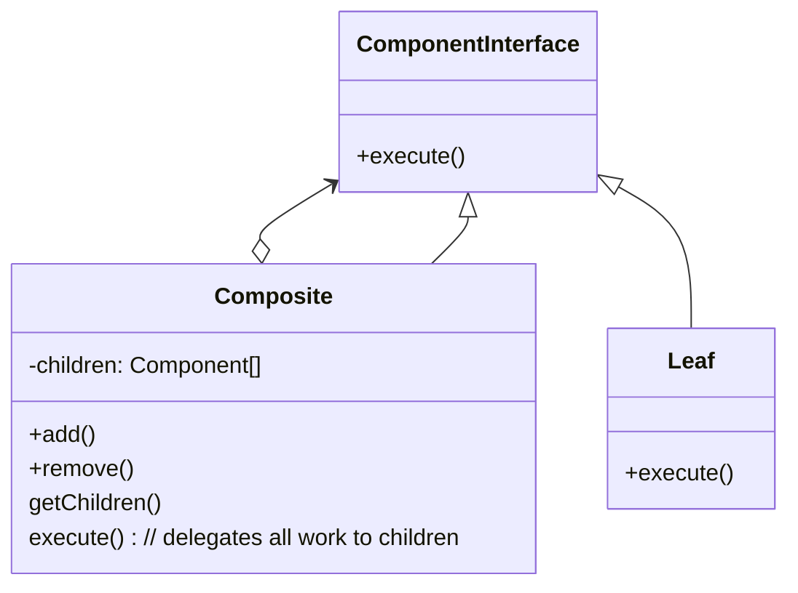

# Composite

The intent of the composite pattern is to represent a recursive tree like structures where individual objects or compositions of objects should be treated uniformly. The most common example is your file structure you have folders and files and folders with files inside other folders etc. You can the perform operations like delete or move on either a single file or folder.

## Structure



## Things to be aware of

### Placement of managing functions

There are 2 possibilities to place the managing functions(add, remove etc.) either in the Component or in the composite. If you place them in the Composite (Safe) there is a clear separation of tasks and are only defined where they are usable, however you might have to make type casts. If you place them in the Component (Transparent) you have a unified look however have to provide the functionality for all components which might not necessarly make sense.

### No cycles

To make sure that one element is not in 2 composites or that there are cycles (a composite is in a higher composite but the higher composite is also in the lower composite). We can add a flag to the abstract class Component to solve this. When adding to a composite we can then make the following checks:

```java
public void addFigure(Figure f) {  
 if (f.contained)  
  throw new IllegalArgumentException();  
 if (contains(f, this)) {  
  throw new IllegalArgumentException();  
 }  
 figures.add(f);  
 f.contained = true;  
}  
  
private boolean contains(Figure g1, GroupFigure g2) {  
 if (g1 == g2) {  
  return true;  
 } else if (g1 instanceof GroupFigure) {  
  for (Figure f : ((GroupFigure) g1).figures) {  
   if (contains(f, g2))  
    return true;  
     }  
 } return false;  
}
```
