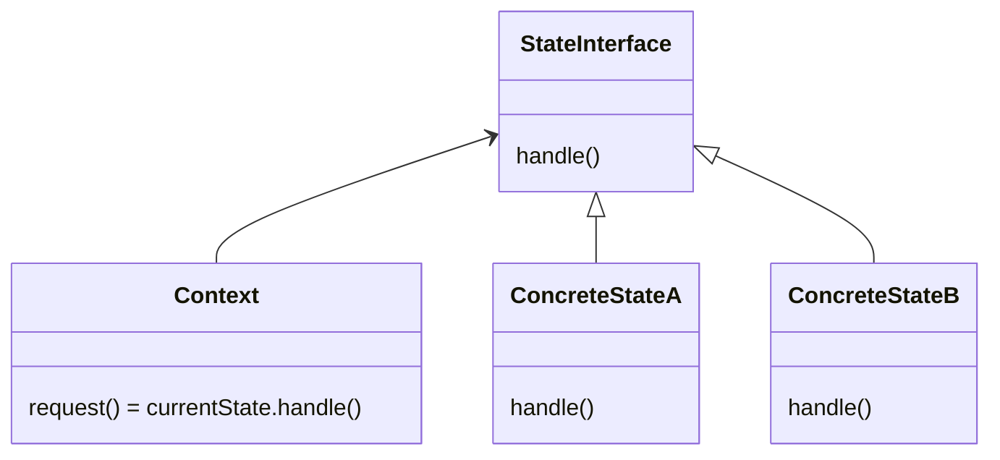

# State

The intent of the state pattern is that we can alter a programs behaviour (just like the strategy pattern) when its internal state changes and outsource the state-dependent behavior. A common example is some sort of dispenser machine that has multiple different states and depending on actions changes its state. For example a ticketmachine can be in the state "INIT" and when the action "enterMoney" is executed the machine changes to the state "MONEY_ENTERED".

## Structure



The hardest part of implementing the state pattern is defining the state interface. The easiest way to do so is to draw a state diagram of the system. All the actions are then the methods in the interface and all the states are the concreteStates.

## Things to be aware of

### State Transition

There are a few ways how state transition can be done.

Decentralized = may be initiated by state objects. For that the state must know its succesors, needs access to a state transition method in the context `context.setState(s);` or return the new state which is then set by the context.

Parameterized = may be signaled by state, executed by context i.e by returning a key e.g a string or int. Association between, keys and states is held in the context.

Centralized = initiated by the context, state should be informed if it is activated or deactivated.

## Creation of state objects

Created when needed = `c.setState(new StateB());` when state changes are rare.
Creation ahead of time = `c.setState(c.STATE_B);` states have to be stored in context.

## Example

```java
public class TicketMachine{
 private int destination;
 private boolean firstClass, dayTicket, halfPrice;
 private double price, enteredMoney;
 private interface State {
  void setDestination(intdestination);
  void setFirstClass(booleanfirstClass);
  void setDayTicket(booleandayTicket);
  void setHalfPrice(booleanhalfPrice);
  void enterMoney(double amount);
  void cancel();
 }
 private final State INIT = new StateInit();
 private final State DEST_SELECTED = new StateDestSelected();
 private final State MONEY_ENTERED = new StateMoneyEntered();
 private State state = INIT;
 
 public void enterMoney(double amount) {
  state.enterMoney(amount);
 }
 // etc...
 abstract class AbstractState implements State {
  public void setDestination(intdestination) {
   throw new IllegalStateException(); }
  public void setFirstClass(booleanfirstClass) {
   throw new IllegalStateException(); }
  public void setDayTicket(booleandayTicket) {
   throw new IllegalStateException(); }
  public void setHalfPrice(booleanhalfPrice) {
   throw new IllegalStateException(); }
  public void enterMoney(double amount) {
   throw new IllegalStateException(); }
  public void cancel() { state = INIT; }
 }
 class StateDestSelected extends AbstractState{
  public void setFirstClass(boolean fc) {
   firstClass= fc;
   price = calculatePrice(destination, firstClass);
  }
  public void enterMoney(double amount) {
   state= MONEY_ENTERED; state.enterMoney(amount);
  }
 }
 class StateMoneyEntered extends AbstractState{
  public void enterMoney(double amount) {
   enteredMoney += amount;
   if (enteredMoney>= price) {
    printTicketWithChange(destination, price, firstClass);
    state = INIT;
   }
  }
 }
}
```
