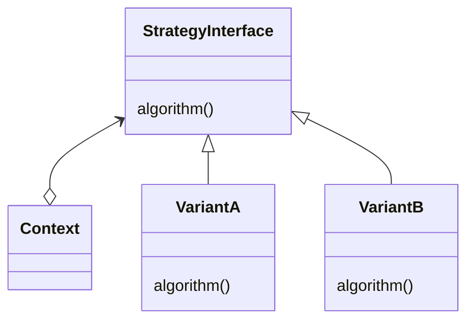

# Strategy

The intent of the strategy pattern is to be able to define a family of algorithms that are interchangable and we can easly add more algorithms if needed. So we also want to be able to change behavior just like in the state pattern. For example we want to support multiple different de/encryption methods. If the algorithm only changes based in its parameters we are not speaking of the strategy pattern.

## Structure

We can see that the Class Diagram is very similiar to that of the state pattern. Importantly here is that the interface is powerful enough to support all current algorithms and also those in the future.



## Example

```java
public class SecureChannel{
 public interface Algorithm{
  public int[] encrypt(byte[] key, int[] plain);
  public int[] decrypt(byte[] key, int[] encrypted);
 }
 private Algorithm algorithm;
 public void setAlgorithm(Algorithm algorithm) {
  if (algorithm == null) throw new IllegalArgumentException();
  this.algorithm= algorithm;
 }
 public void send(byte[] key, int[] plain) {
  write(algorithm.encrypt(key, plain));
 }
 public int[] receive(byte[] key) {
  return algorithm.decrypt(key, read());
 }
}
```
