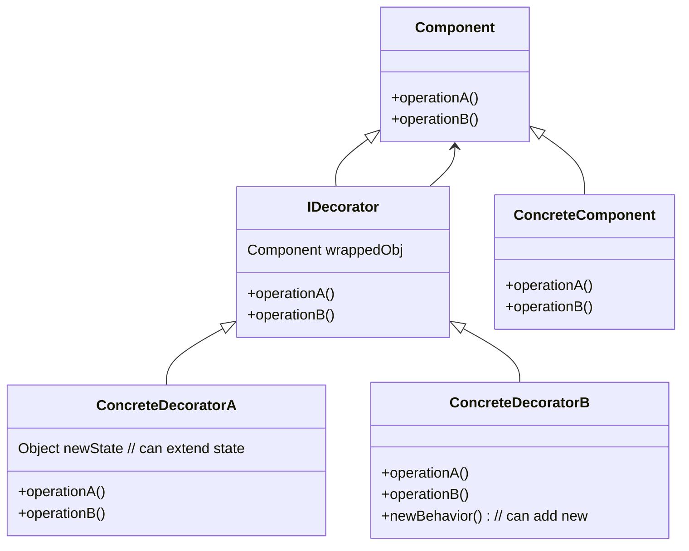

# Decorator

The intent of the decorator pattern is to give objects new responsibilities without overusing inheritance and therefore creating a bunch of classes. Instead Components get decorated to further enhance objects.

## Structure



With this structure you can do things in the decorator before after calling wrappedObj.operationA().

## Example

```java
public abstract class Beverage {
 String description = "Unknown Beverage";
  
 public String getDescription() {
  return description;
 }
 
 public abstract double cost();
}
public abstract class CondimentDecorator extends Beverage {
 public abstract String getDescription();
}
public class Espresso extends Beverage {
  
 public Espresso() {
  description = "Espresso";
 }
  
 public double cost() {
  return 1.99;
 }
}
public class Milk extends CondimentDecorator {
 Beverage beverage;

 public Milk(Beverage beverage) {
  this.beverage = beverage;
 }

 public String getDescription() {
  return beverage.getDescription() + ", Milk";
 }

 public double cost() {
  return .10 + beverage.cost();
 }
}
```
