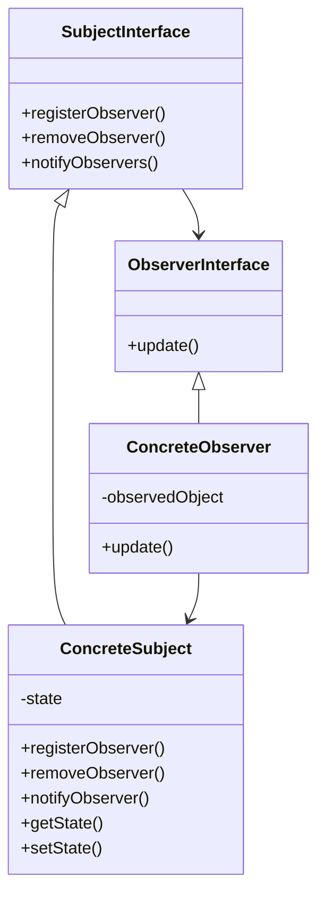

# Observer

The intent of the Observer Pattern is that there a dependant objects of another object and that these dependent objects can be notified of changes without the other object knowing of the dependent objects and the connection between the the cooperating objects being to tight. The Observer Pattern is also commonly know as listener or Publish-Subscribe pattern.

You can find a good detailed description [here](https://refactoring.guru/design-patterns/observer)

## Structure



Often instead of a interface for subject abstract classes are used as the behaviour for the 3 functions is always the same and you can add the data structure for storing the observers.

In java you can use the provided `java.util.Observable` and `java.util.Observer` but is often not recommended.

## Things to be aware of

### How to notify

There are a few ways to notify the observers.

Firstly there is the question of when to notify observers. Either they are notified when the `setState` function is called which is in most cases the way to go and the easiest to implement however it can lead to lots of updates. Or you can explicitly call the update function when you think it is needed, you just need to make sure you don't forget.

Then there is the question of what should a notification look like. We can differentiate between 2 models, push and pull. With pull the object is just notified that there has been a change and then has to get (pull) the actually changes itself.

- `update()` without any parameters.

Or there is the push option where you tell the observer what and where has been changed. This can be done in multiple ways.

- `update(Subject s, Color c)` with sender and/or the exact data that changed. Is easy but can be hard when multiple things changed.
- `update(Subject s, Object args)` with sender and/or Object containing the the changes or the new state, as often seen in C#.
- `update(Event e)` an event object that contains everything as seen in JavaFx or Swing.

### Other small things

There is clearly loose coupling between the subject and the observer as the subject does not know any concrete observers only the interface.

A notification is broadcast, meaning it is sent to all registered observers. It is then up to the observer how it handles notifications.

A simple change of the subjects state can cause a cascade of updates and therefore then multiple notifications.

You must be aware careful that you do not create infinite loops by changing the state in the update function as this will cause the observer to be notified again.

It is good practice to make sure the state really has changed before notifying all the observers and to also not allow the same listener to be added multliple times.

In java you can use a `CopyOnWriteArrayList` as the data structure as it can happen that observers detach in the update method which would change the loop that you iterate over in `notifyObservers()`

## Example

This example is without the Subject interface however if could be added especially if there will be multiple subjects.

```java
public class NewsAgency{
    private String news;
    private List<Observer> channels = new ArrayList<>();

    public void addObserver(Observer channel) {
        this.channels.add(channel);
    }

    public void removeObserver(Observer channel) {
        this.channels.remove(channel);
    }

    public void setNews(String news) {
        this.news = news;
        for (Observer channel : this.channels) {
            channel.update(this.news);
        }
    }
}

public class NewsChannel implements Observer {
    private String news;

    @Override
    public void update(Object news) {
        this.setNews((String) news);
    } 
}

public interface Observer {
    public void update(Object o);
}
```
