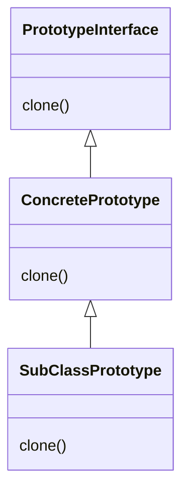

# Prototype

The intent of the prototype pattern is to be able to create new objects by cloning/copying prototype objects.

## Structure



## Solutions

### Cloning based on Object.clone()

In java the following clone method is defined.

```java
class Object {
 protected Object clone() throws CloneNotSupportedException
  ...
 }
}
```

The protected visibility means it can not be invoked on objects of static type and can only be invoked if clone is overridden in a subclass with a suitable visibility.

1. It is checked whether the class implements interface Cloneable (which is only a marker interface). If this is not the case, a CloneNotSupportedException is thrown.
2. A new instance is created, i.e. as much memory as used by the original object is allocated however no constructor is invoked.
3. Instead, the memory of the original object is copied byte by byte into the new instance (a so called memory copy) this means that all attributes are copied over into the new instance if there are fields that are not value types like int etc. but Objects like string etc. then the references are copied resulting in a shallow copy.

If you wish for it not to be a shallow copy you have to override the clone method and clone all the object attributes correctly. When overriding the clone method you can strengthen the result type i.e not returning Object but the correct type. Final fields will just be copied they can not be changed if this is needed then you need to use copy constructors.

### Cloning based on copy constructors

Copy constructors are constructors that receive an instance of their own type as parameter. They then initialize the new instance with the same values as the prototype passed.

### Cloning based on serialization

If all the classes to be cloned are serializable (implement the Serializable interface), cloning can also be implemented with the help of Java serialization. The clone method which follows this approach looks as follows

```java
Object clone() {
 ByteArrayOutputStream baos = new ByteArrayOutputStream();
 ObjectOutputStream oos = new ObjectOutputStream(baos);
 oos.writeObject(this);
 oos.close();
 byte buf[] = baos.toByteArray();
 ByteArrayInputStream bais = new ByteArrayInputStream(buf);
 ObjectInputStream ois = new ObjectInputStream(bais);
 Object c = ois.readObject();
 return c;
}
```
