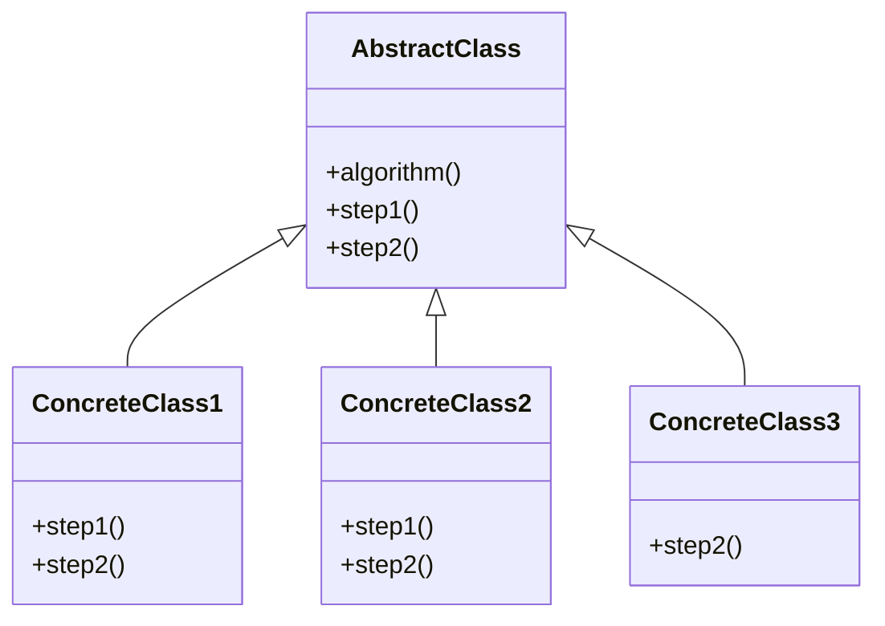

# Template method

The intent of the template method pattern is to define a skeleton of an algorithm in the superclass but lets subclasses override specific steps of the algorithm without changing its structure.

## Structure

